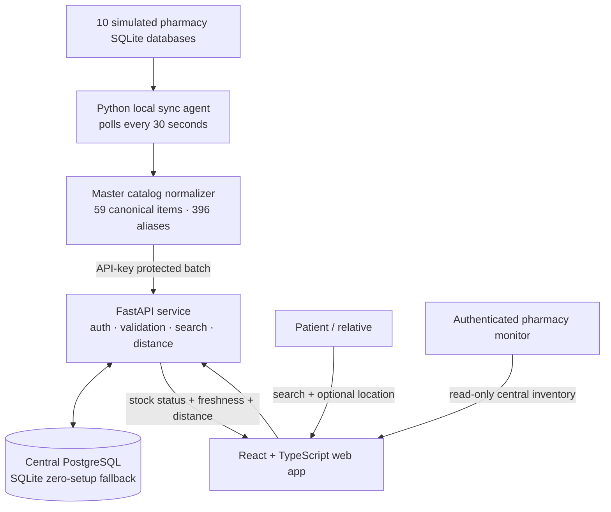

# SurgiMap

**Team Shadow Stack · HackElite 3.0 Phase 2 · Software-only MVP**

SurgiMap helps patients and relatives find nearby pharmacies with urgent surgical kits in stock. It consolidates inventory from ten independent pharmacy data sources, understands inconsistent local item names, and returns only Available or Low Stock results with live sync freshness, distance, map, Call, and WhatsApp actions.

> Medical safety: SurgiMap is a hackathon prototype, not a clinical or purchasing system. Stock can change quickly; users should call the pharmacy before travelling.

## Demo links

- Web app after local start: <http://localhost:5173>
- API documentation: <http://127.0.0.1:8000/docs>
- Public repository: <https://github.com/mansala05/SurgiMap-Repo>
- Demo video:https://youtu.be/QHgVebhWjoM

## Quick start

Prerequisites: Python 3.11+, Node.js 20+, and npm. Docker is optional.

```bash
git clone https://github.com/mansala05/SurgiMap-Repo.git
cd SurgiMap-Repo

cd backend
python3 -m venv .venv
source .venv/bin/activate
pip install -r requirements.txt

cd ../frontend
npm install

cd ..
./start.sh
```

Open <http://localhost:5173>. The launcher starts the API, React app, and inventory agent; it syncs immediately and every 30 seconds. Press `Ctrl+C` once to stop all three processes.

Windows users can run the three processes in separate terminals using the commands in [the software instructions](output/pdf/ShadowStack.pdf).

## Demo credentials

- Pharmacy portal: <http://localhost:5173/login>
- Email: `pharmacy@surgimap.lk`
- Password: `pharmacy123`

These credentials and signing secrets are local-demo defaults only. Replace every value in `backend/.env` for any shared deployment.

## Architecture and system overview



Each pharmacy database represents an independent inventory system. The agent tolerates an unavailable source, normalizes local aliases, and sends a validated batch to the backend. The backend independently derives canonical names and stock status, records sync receipt time, hides zero-stock pharmacies, optionally calculates Haversine distance, and serves the patient UI and authenticated pharmacy monitor.

## Tech stack

| Layer | Technology | Purpose |
|---|---|---|
| Frontend | React 19, TypeScript, Vite, Tailwind CSS | Responsive search and pharmacy-monitor interfaces |
| Maps | Leaflet, OpenStreetMap, OSRM links | Result markers and external directions without a browser API key |
| API | FastAPI, Pydantic | Typed REST endpoints, validation, auth, and OpenAPI docs |
| Data | SQLAlchemy, PostgreSQL / SQLite | Portable central inventory store |
| Integration | Python, SQLite, 30-second polling agent | Simulated multi-pharmacy inventory ingestion |
| Quality | Pytest, ESLint, TypeScript compiler | API, catalog, auth, sync, lint, and production-build checks |

## Key functionality

- Search by canonical kit, local alias, partial phrase, spelling variation, or short code such as `CSK`.
- Normalize 396 aliases into 59 searchable kits and surgical items.
- Return only stocked pharmacies and label results as **Available** or **Low Stock**.
- Sort matching items predictably and, when location is supplied, place nearest pharmacies first.
- Show per-pharmacy sync state as **Live**, **Delayed**, or **Offline**, refreshing every 30 seconds.
- Open Call, WhatsApp, interactive OpenStreetMap, and directions actions from results.
- Protect inventory ingestion with an API key, revalidate data server-side, reject duplicate batch items, and roll back failed batches.
- Protect the pharmacy monitor with signed, expiring sessions; the monitor displays real central inventory and cannot bypass the source-of-truth sync flow.

## Demonstrating automatic stock sync

With `./start.sh` running, open another terminal:

```bash
cd backend
source .venv/bin/activate
python -m scripts.update_demo_stock \
  --pharmacy 1 \
  --item "Laparoscopic / Abdominal Surgery Kit" \
  --quantity 2
```

Search for the kit. The update appears automatically within 30 seconds. To apply a quantity across every simulated pharmacy, use `--all-pharmacies`. To inspect a source database directly:

```bash
cd backend
sqlite3 data/pharmacy_01.db
SELECT item_name, quantity, updated_at FROM inventory LIMIT 10;
.quit
```

Rebuild all ten sources and the central SQLite demo database with:

```bash
cd backend
source .venv/bin/activate
python -m scripts.create_demo_databases
```

## Configuration and deployment

The default launcher uses `backend/surgimap.db`, so judges do not need Docker. To run the proposal-aligned PostgreSQL deployment:

```bash
docker compose up -d postgres
cp backend/.env.example backend/.env
```

Copy `frontend/.env.example` when the API is hosted at another URL. Production deployment should use managed PostgreSQL, HTTPS, restricted CORS origins, long random sync/auth secrets, and a supervised sync-agent process at each pharmacy. No production URL is claimed for this submission; the fully working local deployment is the evaluated path.

## Technical challenges and creative solutions

1. **Inconsistent pharmacy item names.** A search for “C section”, “Cesarean Kit”, or `CSK` must resolve to one stock item. The [master catalog service](backend/app/services/master_catalog.py) combines deterministic normalization, aliases, partial matching, and typo-tolerant suggestions instead of relying on exact database text.

2. **Freshness without misleading users.** Source-row edit time alone made a healthy sync agent look offline, while giving every result the same vague timestamp hid useful state. The [sync endpoint](backend/app/routers/sync.py) records successful receipt time, and the [frontend freshness model](frontend/src/lib/stock.ts) turns that into clear Live, Delayed, and Offline states refreshed every 30 seconds.

3. **A resilient multi-source demo.** One missing or corrupt pharmacy file should not stop nine healthy pharmacies from updating. The [local sync agent](backend/scripts/sync_agent.py) isolates source failures, reports skipped databases, retries API failures, and continues with every valid inventory record.

4. **Safe stock ingestion in a public search product.** The browser must not be able to write stock or trust a client-provided status. The [inventory sync router](backend/app/routers/sync.py) uses a protected server-to-server channel, validates pharmacy IDs and batch size, recalculates canonical names/statuses, rejects duplicates, and uses transaction rollback on failure.

## Scope delivered

### Fully implemented

- Ten independent simulated pharmacy inventory databases with varied quantities, aliases, and timestamps.
- Automatic 30-second synchronization into a central database.
- Alias-aware catalog search, typo suggestions, availability filtering, optional location sorting, and search logging.
- Responsive patient UI with realistic kit imagery, freshness indicators, OpenStreetMap, Call, WhatsApp, and directions.
- Authenticated read-only pharmacy inventory monitor backed by real central data.
- SQLite zero-setup mode, optional PostgreSQL service, example environment files, automated tests, and API docs.

### Partially implemented

- **Pharmacy integration:** the agent reads ten SQLite sources for the MVP; adapters for real pharmacy POS/database products are future work.
- **Authentication:** signed eight-hour demo sessions are implemented for one configured pharmacy account; multi-user administration, password recovery, and audit administration are outside this phase.
- **Routing:** search distance uses a fast straight-line calculation; the directions action delegates the road route to OpenStreetMap/OSRM.

### Not implemented in this phase

- Reservations, online purchasing, delivery, payments, and clinical recommendations.
- Real pharmacy onboarding, production hosting, background-job observability, or push/webhook connectors.
- Native mobile apps and multilingual content.

### Deviations from the ideation architecture

The central store is PostgreSQL-ready through `compose.yaml`, but the submission defaults to SQLite so judges can run it without Docker. Pharmacy systems are simulated as ten SQLite files because access to real commercial inventory databases was not available during the hackathon. Both deviations preserve the proposed data flow and can be replaced without changing the patient search contract.

## Known limitations and judge notes

- Internet access is needed for OpenStreetMap tiles and external route links; search, stock status, Call, and WhatsApp still work without map tiles.
- Browser geolocation is optional. Denial falls back to stock/name ordering and manual demo locations.
- Inventory is prototype data. Always verify by phone before travelling.
- The generated SQLite database files are intentionally included so the MVP works immediately; generated dependencies and build folders are excluded.
- Before final submission, Team Shadow Stack must replace the pending video line near the top of this README with the public YouTube URL.

## Tests and verification

```bash
cd backend
source .venv/bin/activate
pytest -q

cd ../frontend
npm run lint
npm run build
```

The submission-ready runbook is [ShadowStack.pdf](output/pdf/ShadowStack.pdf), the 7–10 minute presentation flow is [docs/DEMO_SCRIPT.md](docs/DEMO_SCRIPT.md), and final human checks are in [docs/SUBMISSION_CHECKLIST.md](docs/SUBMISSION_CHECKLIST.md).

## Repository structure

```text
SurgiMap-Repo/
├── backend/
│   ├── app/              # FastAPI app, routers, models, services
│   ├── data/             # 10 simulated pharmacy SQLite sources
│   ├── scripts/          # build, sync, freshness, and stock demo tools
│   └── tests/            # API, auth, catalog, and sync tests
├── frontend/             # React + TypeScript patient and pharmacy UI
├── docs/                 # demo script and submission checklist
├── output/pdf/           # final software-instructions PDF
├── compose.yaml          # optional PostgreSQL service
├── start.sh              # one-command local launcher
└── README.md
```
