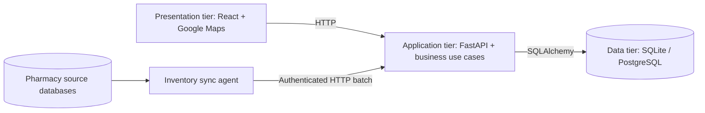

# SurgiMap three-tier architecture

A tier is a runtime responsibility, not just a directory. SurgiMap has three deployment tiers: the browser UI, the Python application server, and the database. The application server is also organized into presentation, business, and data layers, making the boundaries visible in the source code.

## Deployment tiers

| Tier | Implementation | Responsibility |
|---|---|---|
| Presentation | `frontend/` | React pages, pharmacy search and monitor, Google Maps, user interaction; calls HTTP APIs |
| Application / business | `backend/` | FastAPI interface, authentication, catalog normalization, availability rules, distance and ranking, sync validation |
| Data | SQLite by default; optional PostgreSQL in `compose.yaml` | Pharmacy, catalog, inventory and search-log persistence |

The UI never connects directly to the database. Google Maps is an external presentation service. The inventory sync agent is an integration client that submits authenticated HTTP batches to the application tier; source pharmacy databases are external input stores.



## Source organization

```text
SurgiMap-Repo/
├── frontend/                       # Browser presentation tier
│   └── src/
│       ├── pages/                  # Patient and pharmacy portal screens
│       ├── components/             # Cards, Google Maps, auth guard
│       └── lib/                    # HTTP client and UI utilities
├── backend/
│   ├── app/
│   │   ├── main.py                 # Stable app.main:app launch entry point
│   │   ├── presentation/           # HTTP boundary
│   │   │   ├── api.py              # App composition, CORS, lifecycle, error mapping
│   │   │   ├── dependencies.py     # Request-scoped repository wiring
│   │   │   └── routers/            # Search, auth, pharmacies, sync endpoints
│   │   ├── business/               # Application rules; no FastAPI or SQLAlchemy
│   │   │   ├── contracts.py        # Validated use-case input/output models
│   │   │   ├── errors.py           # Application failures
│   │   │   ├── master_catalog.py   # Alias normalization and matching
│   │   │   ├── stock.py            # Availability thresholds and distance
│   │   │   ├── search.py           # Validation, result construction and ranking
│   │   │   ├── auth.py             # Credentials, token signing and session checks
│   │   │   ├── sync.py             # Batch rules and transaction coordination
│   │   │   ├── pharmacies.py       # Pharmacy listing use case
│   │   │   └── health.py           # Health use case
│   │   ├── data/                   # Persistence layer
│   │   │   ├── database.py         # Engine, sessions, startup initialization
│   │   │   ├── models.py           # SQLAlchemy tables and relationships
│   │   │   ├── repositories.py     # Queries, writes and transaction operations
│   │   │   └── seed.py             # Stable demo pharmacy records
│   │   ├── routers/                # Legacy import compatibility files
│   │   ├── services/               # Legacy catalog import compatibility
│   │   └── database.py, models.py, schemas.py, seed.py
│   │                               # Legacy imports of canonical implementations
│   ├── scripts/                    # Sync client and offline demo administration
│   ├── data/                       # Existing source pharmacy SQLite files
│   ├── surgimap.db                 # Existing central SQLite file
│   └── tests/                      # API behavior, rollback and layer boundaries
├── scripts/setup-backend.sh         # Python environment setup and repair
├── compose.yaml                    # Optional PostgreSQL data tier
└── start.sh                        # Same local launch command
```

`backend/app/data/` contains persistence code. `backend/data/` contains source database files. Their paths are retained to preserve existing data and scripts.

## Request flow and ownership

1. React sends a request through `frontend/src/lib/api.ts`.
2. The presentation router validates HTTP parameters and headers. Request dependencies provide a repository backed by the existing database session.
3. A business use case applies catalog, authentication, search or sync rules. It calls repository methods without importing HTTP or ORM code.
4. The data repository performs SQLAlchemy queries and writes against the existing tables.
5. Business results use the existing response models. Presentation serializes them to the same HTTP contract. Application errors become the existing HTTP status, detail and headers.

Sync validates duplicate items before persistence, normalizes names server-side, computes stock status, and commits the batch once. Unknown pharmacies and persistence errors roll back the batch. The repository owns SQL and transaction primitives; the sync use case owns when the transaction succeeds or fails.

The database creation and stock-update scripts are offline administration tools. They intentionally access source files and persistence directly; patient and pharmacy portal requests always follow the layered request flow.

## Compatibility and verification

- Continue using `./start.sh` or `uvicorn app.main:app` from `backend/`.
- API routes, OpenAPI schemas, authentication format, search ordering, status thresholds and sync error responses are preserved.
- Database schema, database paths, environment variables and frontend API settings are preserved; no data migration is required.
- Old Python imports re-export canonical objects, so existing imports and FastAPI dependency overrides remain usable. These files contain no duplicate business implementation.
- Tests enforce layer import boundaries and verify rollback for unknown pharmacies and persistence failure, legacy imports, and legacy URL/query aliases.

Run `cd backend && .venv/bin/python -m pytest -q`. Frontend checks remain `npm run lint`, `npx tsc --noEmit`, and `npm run build` from `frontend/`.

This is a layered monolith inside the application tier. Separate microservices, new deployment requirements and abstract repository frameworks are unnecessary for this project’s scope.
